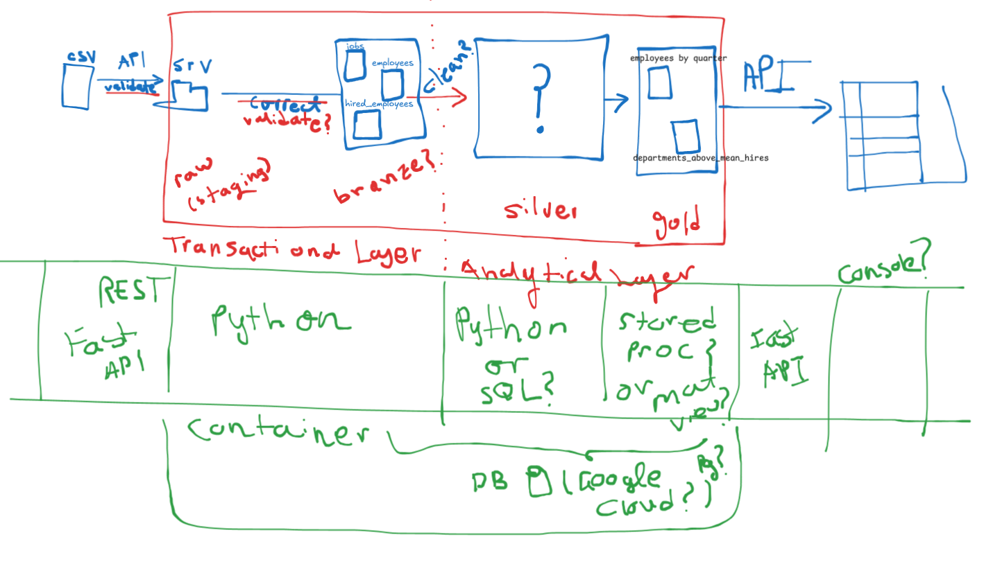

# Globant Data Engineer Coding Challenge

Hello! This is the code repository for the soluiton to the Globant Data Engineer coding challenge.

The challenge was to create a data engineering pipeline that can provide Analytics for an internal employee management system, through a REST API.

## Architecture
 
First draft of architecture for the solution: 

## Tech Stack

- Medallion architecture:
  - Bronze: Raw data ingestion from CSV files
  - Silver: Data cleaning and transformation into Data Model
  - Gold: Aggregated data for analytics
- REST API: FastAPI application to serve the aggregated data
- Python to ingest, validate and clean data
- DBMS: SQLite (Migrate to Postgres in a future iteration)
- Docker for container and environment management

## How to run

1. Clone the repository
2. Launch docker-compose
3. Acces the FastApi documentation site, to graphically interact with the API: `http://localhost:8000/docs`
4. Navigate to the endpoints and test them out.

---------

Developed with 💗 by camilotorresmestra

